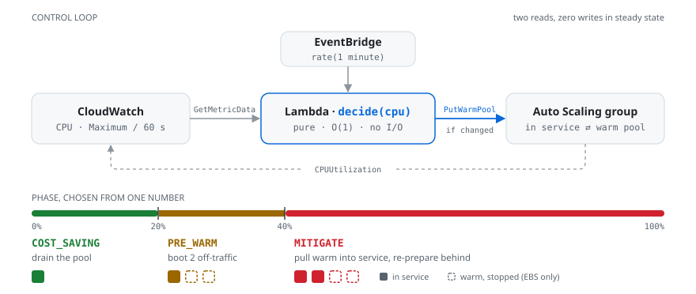

# Jayasankar M R

### Cloud &amp; DevOps Engineer · Final-Year CSE Student

**Making systems faster, cheaper, and more reliable.**

 

---

## About

Final-year B.Tech Computer Science student at **SRM Institute of Science and Technology, Delhi-NCR** (**CGPA 9.35/10**) and an **AWS Certified Cloud Practitioner** who builds and automates cloud infrastructure.

I like problems where the win is measurable. My latest project, [**warm-pool-governor**](https://github.com/jayasankarmr/warm-pool-governor), is a Python + Terraform controller that resizes an EC2 Auto Scaling warm pool from live CPU. That's something no native AWS scaling policy does, and it projects **63.8% below always-on** cost.

I've also shipped to production outside coursework — six months owning DNS, secure routing, release and incident response for two live client platforms during an industry internship.

**Currently:** working toward AWS Solutions Architect – Associate (Dec 2026) · learning Terraform and Kubernetes · open to internships and 2027 new-grad roles.

---

## Experience

**Systems and Integrations Developer Intern → Trainee** · *GeToday Global Limited, London (Remote)* · `Jun 2025 – Dec 2025`

- Owned the provisioning and production release lifecycle for **two live client platforms** end to end — DNS records, secure routing, SSL/TLS and environment configuration — taking each to live traffic.
- Ran post-release operations with minimal supervision: monitored platform health, triaged incidents, traced faults to root cause and verified fixes on **revenue-generating systems**.
- Built REST API integrations feeding third-party catalogues into core infrastructure, automating revenue-split and payment-gateway workflows. **Promoted to Trainee within the term.**

**AI-Powered Cloud Engineer Virtual Intern** · *AWS &amp; AICTE* · `2025`

- Hands-on AWS labs in cloud architecture and infrastructure management, applying least-privilege IAM, monitoring and cost controls.

---

## Certifications

<!-- Between the credly markers is generated by .github/workflows/credly.yml from the
     public Credly profile. Edit .github/scripts/credly.py, not this block. -->
<!--START_SECTION:credly-->
<table>
<tr>
<td align="center" width="130">

</td>
<td>

**AWS Certified Cloud Practitioner**
`EARNED Jun 2026` · valid to Jun 2029 · Amazon Web Services

[Verify on Credly →](https://www.credly.com/badges/7d2823e1-296d-4fbc-b71e-0c4e117b706b)

</td>
<td align="center" width="130">

</td>
<td>

**AWS Certified Solutions Architect – Associate**
`IN PROGRESS` · targeting Dec 2026

</td>
</tr>
</table>

**Training badges** (10 · hover for names)

         
<!--END_SECTION:credly-->

Also: **The Bits and Bytes of Computer Networking** — Google (Coursera) · [all badges on Credly →](https://www.credly.com/users/jayasankar-m-r.eede608c)

---

## Tech Stack

AWS (EC2, Auto Scaling, Lambda, CloudWatch, IAM, VPC) · Python / Boto3 · Linux · Docker · GitHub Actions · SQL

<b>Full stack, by area</b>

 

**Cloud Platforms**

         

Auto Scaling · Elastic Load Balancing · Warm Pools · high availability · cost optimisation · backup &amp; DR

**Infrastructure &amp; Automation**

   

**DevOps &amp; Containers**

  

CI/CD pipelines · container deployment · Agile/Scrum · change &amp; release management

**Observability &amp; Reliability**

CloudWatch metrics, alarms &amp; dashboards · log analysis · uptime monitoring · incident triage · root-cause analysis

**Networking &amp; Security**

TCP/IP · DNS · HTTP/HTTPS · SSL/TLS · routing · load balancing · firewalls · IAM/RBAC · least privilege

**Databases &amp; Languages**

        

**Foundational — currently learning**

 

Coursework and self-study, not yet production experience.

---

## Featured Projects

### [warm-pool-governor](https://github.com/jayasankarmr/warm-pool-governor)
**Resizes an EC2 Auto Scaling warm pool from live CPU. AWS only lets you size it once, by hand.**

<picture>
  <source media="(prefers-color-scheme: dark)" srcset="assets/warm-pool-governor-dark.svg" />
  
</picture>

<table>
<tr>
<td width="25%" align="center"><h3>63.8%</h3>projected cost saving</td>
<td width="25%" align="center"><h3>2m43s</h3>sooner than a CPU alarm</td>
<td width="25%" align="center"><h3>O(1)</h3>pure decision, no forecast</td>
<td width="25%" align="center"><h3>604</h3>tests, run fully offline</td>
</tr>
</table>

- Every native scaling policy only moves `DesiredCapacity`. This moves the warm pool's own bounds, so standby capacity exists while load needs it and drains to zero when it doesn't.
- In steady state each tick is **two reads, zero writes**. Writes are ordered so every intermediate state stays valid.
- Missing metric data is treated as unknown, not as 0%, so a broken monitoring pipeline can't drain the pool mid-spike.
- Terraform deploys both the baseline and the governor, with **five IAM actions** scoped to one group. CI runs `tflint` and `checkov`.

`Python` `Boto3` `Lambda` `EC2 Auto Scaling` `CloudWatch` `EventBridge` `Terraform` `GitHub Actions`

[**Repository →**](https://github.com/jayasankarmr/warm-pool-governor)

 

<table>
<tr>
<td width="33%" valign="top">

### LifeDrop
**Blood bank management system**

Multi-role app connecting donors, hospitals and admins.

- Role-based access for three user types
- Inventory with **low-stock alerts**
- Rate limiting, CSRF protection, CSP
- Deployed and operated on Linux

`Flask` `SQLAlchemy` `SQLite` `Tailwind`

[**Live demo →**](https://lifedrop-demo.onrender.com/) · [Repo](https://github.com/jayasankarmr/LifeDrop)

</td>
<td width="33%" valign="top">

### Downright
**Chrome / Edge extension**

Copy any page as clean Markdown in one keystroke, with correct tables, code fences and math.

- Handles the cases most converters break on
- **No tracking, no network. Ever.** Everything runs locally.

`JavaScript` `Chrome Extension API`

[**Repository →**](https://github.com/jayasankarmr/Downright)

</td>
<td width="33%" valign="top">

### Credit Risk Analyser
**Default-risk modelling**

End-to-end credit default risk pipeline.

- Feature engineering on borrower and loan attributes
- Model comparison and evaluation

`scikit-learn` `Pandas` `Jupyter`

[**Repository →**](https://github.com/jayasankarmr/credit-risk-analyser)

</td>
</tr>
</table>

---

## Contribution Tracker

<!-- Snake animation: generated by .github/workflows/snake.yml, published to the `output` branch.
     Appears blank until that workflow has run once. -->
<picture>
  <source media="(prefers-color-scheme: dark)" srcset="https://raw.githubusercontent.com/jayasankarmr/jayasankarmr/output/github-snake-dark.svg" />
  
</picture>

 

<picture>
  <source media="(prefers-color-scheme: dark)" srcset="https://streak-stats.demolab.com/?user=jayasankarmr&hide_border=true&theme=github-dark-blue&date_format=M%20j%5B%2C%20Y%5D" />
  
</picture>

<!-- ───────────────────────────────────────────────────────────────────────────
     GitHub stats + top-languages cards.

     Deliberately commented out: every public instance of github-readme-stats is
     currently rate-limited into the ground and serves a "Maximum retries exceeded"
     error card instead of your stats. Shipping it would put a broken card on your
     profile, which is worse than no card.

     To turn these on, self-host the service (~5 minutes, free) and swap the
     hostname below. Step-by-step in .github/SETUP.md, "Enabling the stats cards".
     ─────────────────────────────────────────────────────────────────────────── -->
<!--
<picture>
  <source media="(prefers-color-scheme: dark)" srcset="https://YOUR-INSTANCE.vercel.app/api?username=jayasankarmr&show_icons=true&include_all_commits=true&count_private=true&hide_border=true&theme=github_dark&title_color=58A6FF&icon_color=58A6FF" />
  
</picture>
<picture>
  <source media="(prefers-color-scheme: dark)" srcset="https://YOUR-INSTANCE.vercel.app/api/top-langs/?username=jayasankarmr&layout=compact&hide_border=true&langs_count=8&theme=github_dark&title_color=58A6FF" />
  
</picture>
-->

---

## Beyond Code

**Vice Chairperson, ACM — SRM Student Chapter** · `Aug 2025 – Present`
Led a cross-functional team through the full delivery lifecycle of *Visualize It*, a data competition for **40+ participants**.

**Photography** · where I go when I'm not in a terminal

  

[Full portfolio →](https://jayasankarmr.github.io/Photography-Portfolio/)

**Rajya Puraskar Awardee** · The Bharat Scouts and Guides
State-level award for leadership and community service.

---

**Best way to reach me:** [jayasankar.mr7@gmail.com](mailto:jayasankar.mr7@gmail.com) · I reply within a day.

