<div align="center">

<picture><source media="(prefers-color-scheme: dark)" srcset="assets/hero-dark.svg" />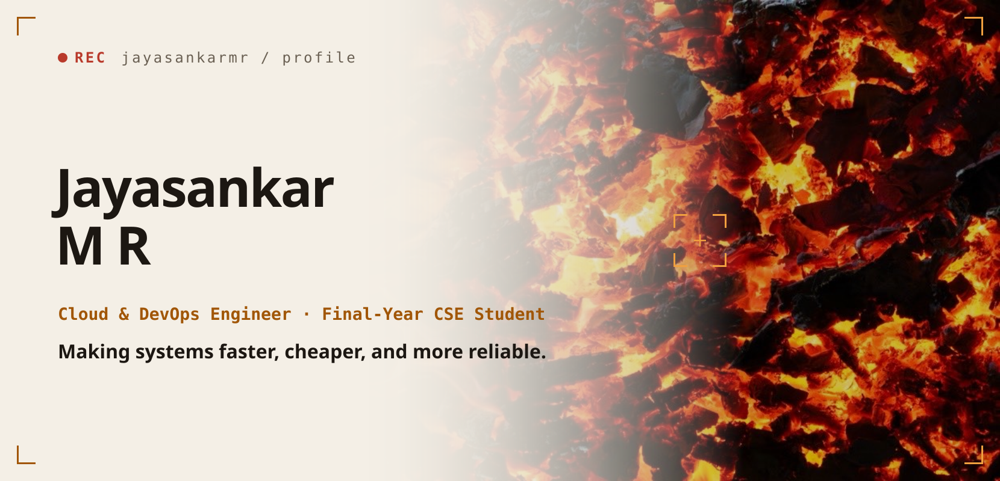</picture>

<a href="https://www.linkedin.com/in/jayasankar-m-r-1483802a5"><picture><source media="(prefers-color-scheme: dark)" srcset="assets/link-linkedin-dark.svg" /></picture></a>
<a href="mailto:jayasankar.mr7@gmail.com"><picture><source media="(prefers-color-scheme: dark)" srcset="assets/link-email-dark.svg" />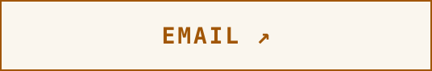</picture></a>
<a href="https://www.credly.com/users/jayasankar-m-r.eede608c"><picture><source media="(prefers-color-scheme: dark)" srcset="assets/link-credly-dark.svg" />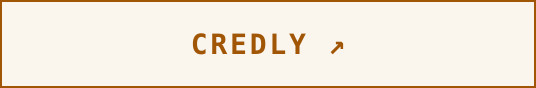</picture></a>

<picture><source media="(prefers-color-scheme: dark)" srcset="assets/status-dark.svg" />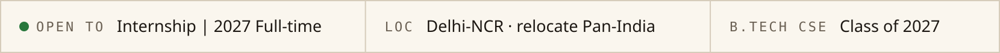</picture>

</div>

<br />

<picture><source media="(prefers-color-scheme: dark)" srcset="assets/hdr-01-flagship-dark.svg" /></picture>

### [warm-pool-governor](https://github.com/jayasankarmr/warm-pool-governor)
**Resizes an EC2 Auto Scaling warm pool from live CPU. AWS only lets you size it once, by hand.**

<a href="https://github.com/jayasankarmr/warm-pool-governor"><picture><source media="(prefers-color-scheme: dark)" srcset="assets/stats-dark.svg" />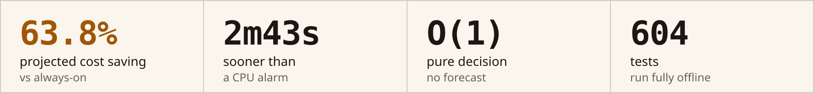</picture></a>

<picture><source media="(prefers-color-scheme: dark)" srcset="assets/governor-dark.svg" />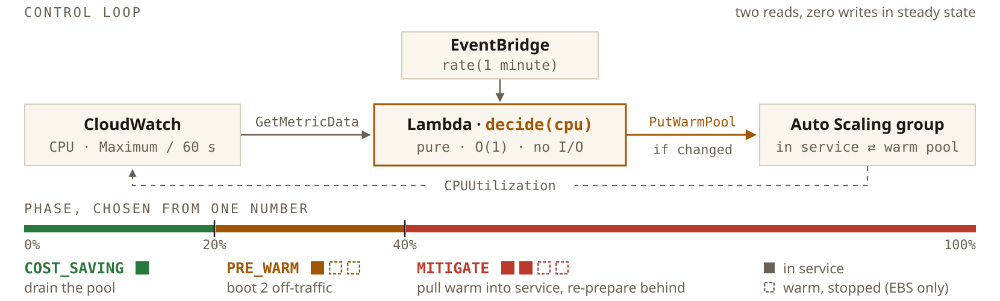</picture>

- Every native scaling policy only moves `DesiredCapacity`. This moves the warm pool's own bounds, so standby capacity exists while load needs it and drains to zero when it doesn't.
- In steady state each tick is **two reads, zero writes**. Writes are ordered so every intermediate state stays valid.
- Missing metric data is treated as unknown, not as 0%, so a broken monitoring pipeline can't drain the pool mid-spike.
- Terraform deploys both the baseline and the governor, with **five IAM actions** scoped to one group. CI runs `tflint` and `checkov`.

`Python` · `Boto3` · `Lambda` · `EC2 Auto Scaling` · `CloudWatch` · `EventBridge` · `Terraform` · `GitHub Actions` · [**Repository →**](https://github.com/jayasankarmr/warm-pool-governor)

<br />

<picture><source media="(prefers-color-scheme: dark)" srcset="assets/hdr-02-about-dark.svg" /></picture>

Final-year B.Tech Computer Science student at **SRM Institute of Science and Technology, Delhi-NCR** (**CGPA 9.35/10**) and an **AWS Certified Cloud Practitioner** who builds and automates cloud infrastructure.

I like problems where the win is measurable, and I've shipped to production outside coursework: six months owning DNS, secure routing, release and incident response for two live client platforms during an industry internship.

```text
now  working toward AWS Solutions Architect – Associate (Dec 2026)
     learning Terraform and Kubernetes
     open to internships and 2027 new-grad roles
```

<picture><source media="(prefers-color-scheme: dark)" srcset="assets/about-dark.svg" />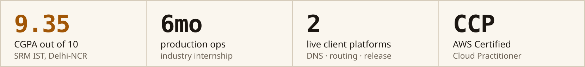</picture>

<br />

<picture><source media="(prefers-color-scheme: dark)" srcset="assets/hdr-03-experience-dark.svg" />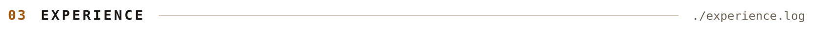</picture>

<table>
<tr>
<td width="120" valign="top"><code>2025-06 →</code><br /><code>2025-12</code></td>
<td valign="top">

**Systems and Integrations Developer Intern → Trainee**<br />
<sub>GeToday Global Limited, London (Remote)</sub>

- Owned the provisioning and production release lifecycle for **two live client platforms** end to end: DNS records, secure routing, SSL/TLS and environment configuration, taking each to live traffic.
- Ran post-release operations with minimal supervision: monitored platform health, triaged incidents, traced faults to root cause and verified fixes on **revenue-generating systems**.
- Built REST API integrations feeding third-party catalogues into core infrastructure, automating revenue-split and payment-gateway workflows. **Promoted to Trainee within the term.**

</td>
</tr>
<tr>
<td width="120" valign="top"><code>2025</code></td>
<td valign="top">

**AI-Powered Cloud Engineer Virtual Intern**<br />
<sub>AWS &amp; AICTE</sub>

- Hands-on AWS labs in cloud architecture and infrastructure management, applying least-privilege IAM, monitoring and cost controls.

</td>
</tr>
</table>

<picture><source media="(prefers-color-scheme: dark)" srcset="assets/hdr-04-certifications-dark.svg" /></picture>

<!-- Between the credly markers is generated by .github/workflows/credly.yml from the
     public Credly profile. Edit .github/scripts/credly.py, not this block. -->
<!--START_SECTION:credly-->
<table>
<tr>
<td align="center" width="130">
<a href="https://www.credly.com/badges/7d2823e1-296d-4fbc-b71e-0c4e117b706b">

</a>
</td>
<td>

**AWS Certified Cloud Practitioner**
`EARNED Jun 2026` · valid to Jun 2029 · Amazon Web Services

[Verify on Credly →](https://www.credly.com/badges/7d2823e1-296d-4fbc-b71e-0c4e117b706b)

</td>
<td align="center" width="130">

</td>
<td>

**AWS Certified Solutions Architect – Associate**
`IN PROGRESS` · targeting Dec 2026

</td>
</tr>
</table>

**Training badges** <sub>(10 · hover for names)</sub>

<a href="https://www.credly.com/badges/80728662-f747-4dd4-aa2d-9a89366c8b36"></a> <a href="https://www.credly.com/badges/ad9d3712-4b46-4f90-a958-ea0389315d6d"></a> <a href="https://www.credly.com/badges/c5e59b6c-96f9-4910-828c-0e68e4575280"></a> <a href="https://www.credly.com/badges/26c76833-a4e0-4e68-83c2-8437cf4473d1"></a> <a href="https://www.credly.com/badges/10f20ec4-271a-4059-a18a-494fbafef2e0"></a> <a href="https://www.credly.com/badges/2e227766-3789-4585-85be-6590a511000c"></a> <a href="https://www.credly.com/badges/dd615cc3-dfcf-406e-992e-8a87e651cbb4"></a> <a href="https://www.credly.com/badges/7bf6bd1c-1ab8-465d-9cad-52c7dce28e17"></a> <a href="https://www.credly.com/badges/24da4581-3fd6-47dd-895f-fb75b07d8d9d"></a> <a href="https://www.credly.com/badges/b0393431-408d-4398-900b-c06c8135f38d"></a>
<!--END_SECTION:credly-->

Also: **The Bits and Bytes of Computer Networking** · Google (Coursera) · [all badges on Credly →](https://www.credly.com/users/jayasankar-m-r.eede608c)

<br />

<picture><source media="(prefers-color-scheme: dark)" srcset="assets/hdr-05-projects-dark.svg" />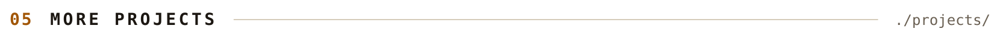</picture>

<table>
<tr>
<td width="33%" valign="top">
<a href="https://github.com/jayasankarmr/LifeDrop"><picture><source media="(prefers-color-scheme: dark)" srcset="assets/project-lifedrop-dark.svg" />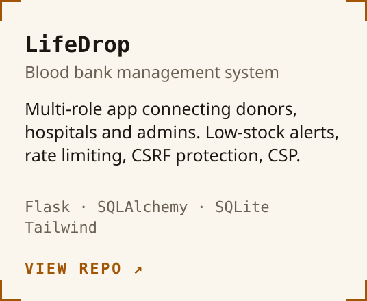</picture></a>
<sub><a href="https://lifedrop-demo.onrender.com/">Live demo →</a> · <a href="https://github.com/jayasankarmr/LifeDrop">Repo</a></sub>
</td>
<td width="33%" valign="top">
<a href="https://github.com/jayasankarmr/Downright"><picture><source media="(prefers-color-scheme: dark)" srcset="assets/project-downright-dark.svg" />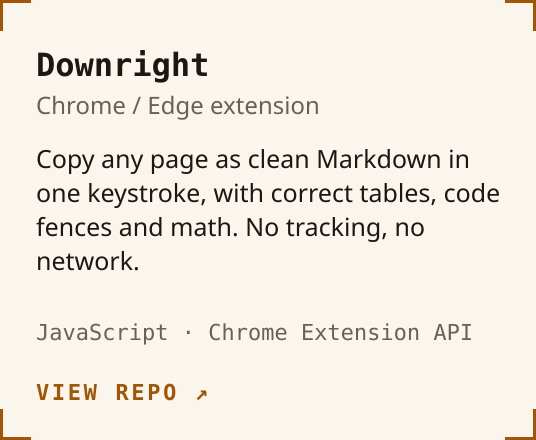</picture></a>
<sub><a href="https://github.com/jayasankarmr/Downright">Repo →</a></sub>
</td>
<td width="33%" valign="top">
<a href="https://github.com/jayasankarmr/credit-risk-analyser"><picture><source media="(prefers-color-scheme: dark)" srcset="assets/project-credit-risk-dark.svg" />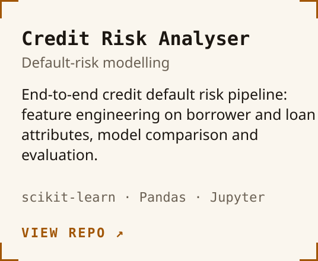</picture></a>
<sub><a href="https://github.com/jayasankarmr/credit-risk-analyser">Repo →</a></sub>
</td>
</tr>
</table>

<picture><source media="(prefers-color-scheme: dark)" srcset="assets/hdr-06-stack-dark.svg" /></picture>

```text
cloud    AWS (EC2 · Auto Scaling · Lambda · CloudWatch · IAM · VPC · S3 · RDS) · Azure · GCP
code     Python · Boto3 · Bash · Linux · SQL · C++ · JavaScript · TypeScript
devops   Docker · GitHub Actions · Git · CI/CD · Agile/Scrum
observe  CloudWatch metrics, alarms & dashboards · log analysis · incident triage · RCA
network  TCP/IP · DNS · HTTP/S · SSL/TLS · load balancing · IAM/RBAC · least privilege
data     PostgreSQL · MySQL · SQLite · MongoDB · Flask · Node.js
learning Terraform · Kubernetes (coursework and self-study)
```

<picture><source media="(prefers-color-scheme: dark)" srcset="assets/hdr-07-activity-dark.svg" /></picture>

<!-- assets/activity-*.svg is generated daily by .github/workflows/activity.yml. -->
<picture><source media="(prefers-color-scheme: dark)" srcset="assets/activity-dark.svg" /></picture>

<picture><source media="(prefers-color-scheme: dark)" srcset="assets/hdr-08-beyond-dark.svg" /></picture>

**Vice Chairperson, ACM, SRM Student Chapter** · `Aug 2025 – Present`<br />
Led a cross-functional team through the full delivery lifecycle of *Visualize It*, a data competition for **40+ participants**.

**Rajya Puraskar Awardee** · The Bharat Scouts and Guides<br />
State-level award for leadership and community service.

**Photography** · where I go when I'm not in a terminal

<a href="https://jayasankarmr.github.io/Photography-Portfolio/"><picture><source media="(prefers-color-scheme: dark)" srcset="assets/frame-tower-dark.svg" />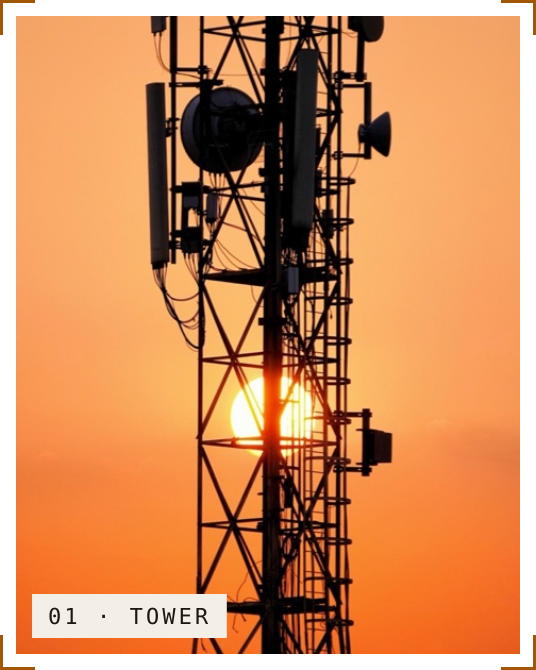</picture></a>
<a href="https://jayasankarmr.github.io/Photography-Portfolio/"><picture><source media="(prefers-color-scheme: dark)" srcset="assets/frame-peacock-dark.svg" />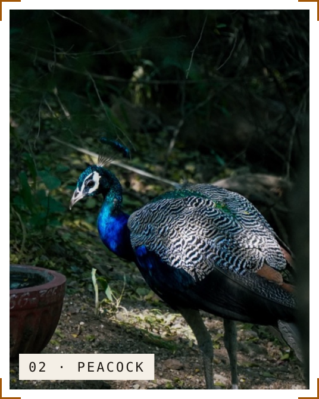</picture></a>
<a href="https://jayasankarmr.github.io/Photography-Portfolio/"><picture><source media="(prefers-color-scheme: dark)" srcset="assets/frame-cupola-dark.svg" />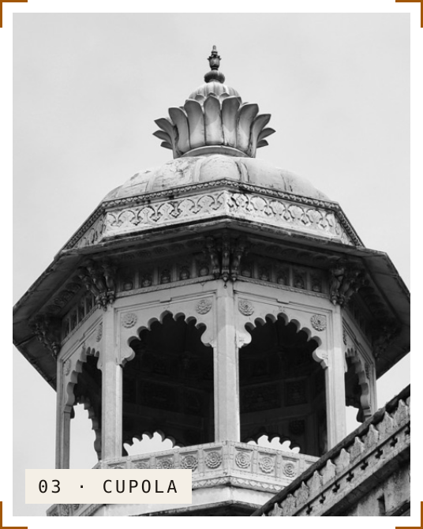</picture></a>

<sub>[Full portfolio →](https://jayasankarmr.github.io/Photography-Portfolio/)</sub>

<br />

<div align="center">

**Best way to reach me:** [jayasankar.mr7@gmail.com](mailto:jayasankar.mr7@gmail.com) · I reply within a day.

</div>
